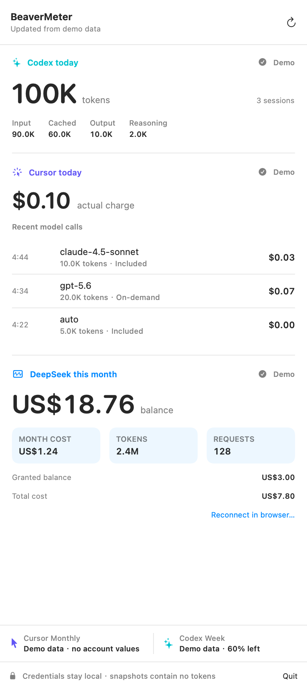
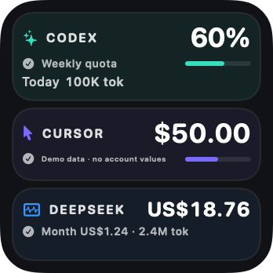
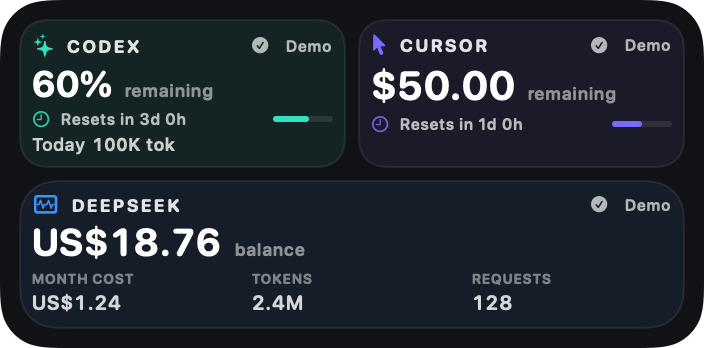
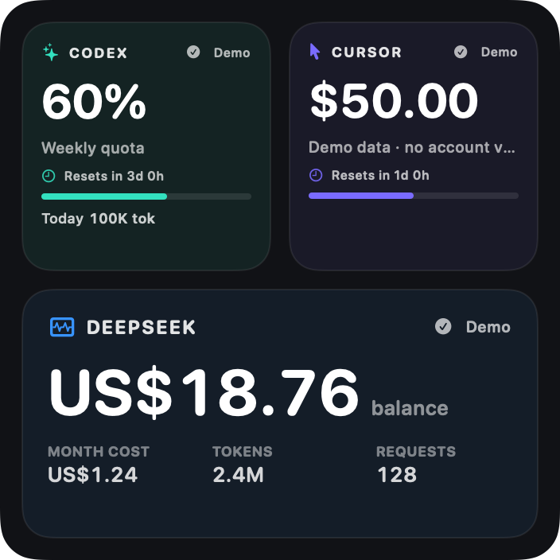
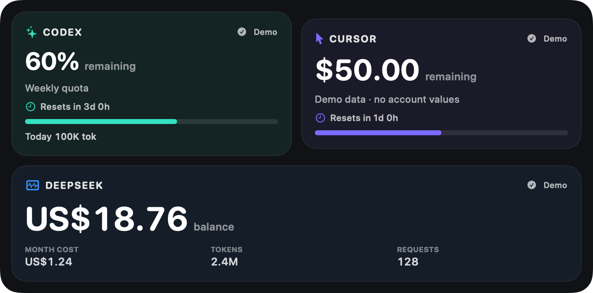

# AI Token Quota Widget

[](https://www.apple.com/macos/)
[](https://www.swift.org/)
[](https://github.com/fusheng-ji/token_quota_widget)
[](LICENSE)

AI Token Quota Widget is a native macOS menu-bar utility and WidgetKit
extension that keeps Codex token activity and account quota alongside Cursor
model-call costs and monthly allowance. It provides a quick desktop summary,
with call-level detail available from the menu-bar popover.

The installed app and Widget continue to use the public name `Cursor + Codex`.
Internal `CodexWeek` target names, bundle IDs, the app path, LaunchAgent label,
and snapshot path also remain unchanged so existing installations upgrade in
place.

## Interface

The menu bar shows a compact token-and-cost summary. Its popover adds Codex
input, cached input, output and reasoning totals; Cursor's daily actual charge;
and the latest 20 model calls with time, model, optional token count and charge.

The Widget has no overall title and always presents Codex and Cursor as two
equal quota panels:

| Family | Layout |
| --- | --- |
| Small | Two compact panels stacked vertically |
| Medium | Two regular panels side by side |
| Large | Two full-width panels stacked vertically |
| Extra Large | Two full-width panels stacked vertically with more breathing room |

<table>
  <tr>
    <th colspan="2">Menu-bar popover</th>
  </tr>
  <tr>
    <td colspan="2" align="center">
      
    </td>
  </tr>
  <tr>
    <th>Small Widget</th>
    <th>Medium Widget</th>
  </tr>
  <tr>
    <td align="center">
      
    </td>
    <td align="center">
      
    </td>
  </tr>
  <tr>
    <th>Large Widget</th>
    <th>Extra Large Widget</th>
  </tr>
  <tr>
    <td align="center">
      
    </td>
    <td align="center">
      
    </td>
  </tr>
</table>

Every image above is generated from the bundled Preview snapshot and visibly
marked as `Demo`. No screenshot contains live account values or personal Cursor
usage.

Every panel includes a service label, remaining value, reset countdown, status
text and progress line. Codex is teal and Cursor is indigo; values below 50%
turn amber and values below 20% turn red. The numeric value and status remain
visible, so meaning never depends on color alone. Stale, signed-out and error
states are called out explicitly.

## Data sources and semantics

### Codex tokens

The bundled collector uses
[CodexBarCore](https://github.com/steipete/CodexBar/) pinned to commit
[`5d7c1f29fd11ecbf697b3532340f75b25319f811`](https://github.com/steipete/CodexBar/commit/5d7c1f29fd11ecbf697b3532340f75b25319f811).
Its local scanner aggregates the current local day across `~/.codex/sessions`,
including compressed sessions, duplicate events and file boundaries.

The displayed total is `input + output`. Cached input is a subset of input and
reasoning is a subset of output, so those counters are details and are not
added a second time.

### Cursor call costs and Monthly usage

The collector reads Cursor's existing local sign-in token from `state.vscdb`,
keeps it in process memory, and requests the same official Dashboard data used
by [cursor.com/dashboard/usage](https://cursor.com/dashboard/usage):

```text
https://cursor.com/api/dashboard/get-filtered-usage-events
https://cursor.com/api/usage-summary
```

Each call uses `chargedCents`, the amount actually deducted by Cursor. It does
not substitute `tokenUsage.totalCents`, which is the model provider's list
price. Calls charged at `$0.00` remain visible. If an otherwise valid call has
no valid actual charge, that row says the charge is unknown and the daily total
is withheld rather than understated.

Monthly usage uses `individualUsage.plan`, then `individualUsage.overall` when
Cursor exposes an individual Enterprise allowance. `teamUsage.pooled` and
administrator Team Caps are never used as personal Monthly usage.

### Codex quota

The quota panel reads the existing Codex sign-in from `~/.codex/auth.json` and
requests:

```text
https://chatgpt.com/backend-api/wham/usage
```

Windows are identified by `limit_window_seconds`; the window with the least
remaining allowance becomes the Widget summary. Credits-only responses show a
balance, unlimited or exhausted state without inventing a percentage.

## Refresh and fallback

The app refreshes on launch, when the popover opens, on manual refresh and
every five minutes through the existing LaunchAgent. The Widget requests a
matching five-minute timeline, subject to WidgetKit scheduling.

Codex tokens, Cursor costs, Cursor quota and Codex quota refresh independently.
If one source fails, its most recent successful value remains visible as stale
while the other sources keep updating. Cache older than three hours receives a
strong warning. Missing live data is never replaced with preview data.

## Privacy

- Credentials come only from existing local Cursor and Codex sessions and
  remain in collector memory.
- The snapshot contains no access tokens, cookies, user/team/conversation IDs,
  prompts or response content.
- Requests are restricted to `cursor.com` and `chatgpt.com`, require successful
  HTTP status codes, validate their response shape and use finite timeouts.
- The snapshot is atomically replaced at
  `~/Library/Application Support/CodexWeek/codex-week-snapshot.json`.
- Its directory is mode `700` and the snapshot is mode `600`.
- All repository screenshots use deterministic `Demo` data from
  `UsageSnapshot.preview`; they never contain live account values or personal
  Cursor usage.

## Requirements and installation

- macOS 14 or newer
- Cursor signed in locally
- Codex desktop app or CLI used locally
- Full Xcode in `/Applications/Xcode.app`
- [XcodeGen](https://github.com/yonaskolb/XcodeGen)

Install or upgrade:

```bash
brew install xcodegen
chmod +x scripts/*.sh Tests/collector_test.sh
./scripts/install.sh
```

The installer asks for an optional Apple Developer Team ID, a unique bundle
prefix, local data paths and a refresh interval (five minutes by default). It
builds a Release app at `~/Applications/CodexWeek.app`, updates the existing
`io.github.codexweek.refresh` LaunchAgent, registers the Widget and starts the
menu-bar app.

## Development and tests

Generate the project and run the seven Swift tests:

```bash
xcodegen generate
xcodebuild \
  -project CodexWeek.xcodeproj \
  -scheme CodexWeek \
  -derivedDataPath /tmp/codexweek-derived \
  test
```

Run the network-free collector integration test against that build:

```bash
./Tests/collector_test.sh \
  /tmp/codexweek-derived/Build/Products/Debug/CodexWeekCollector
```

The `CodexWeekPreviewRenderer` target regenerates the README screenshots from
`UsageSnapshot.preview`; it never reads the production snapshot.

The collector accepts these fixture overrides:

```text
CODEX_TOKEN_FIXTURE
CODEX_USAGE_FIXTURE
CURSOR_EVENTS_FIXTURE
CURSOR_SUMMARY_FIXTURE
CURSOR_STATE_DB
```

Coverage includes schema v3 decoding, v2 quota migration, percent clamping,
Codex token subset semantics, single and multiple quota windows, tolerant
Cursor number decoding, zero-cost events, pagination boundaries, actual-charge
totals, personal Monthly usage precedence, independent fallback, snapshot
permissions and privacy. SwiftUI previews cover all four Widget families plus
ready, stale, signed-out/error and missing-reset states.

## Troubleshooting

- **Cursor says Sign in:** open Cursor, confirm the intended account is active,
  then click refresh.
- **Codex has no token data:** run at least one local Codex session and refresh.
- **Data is stale:** inspect `~/Library/Logs/CodexWeek/` and verify access to
  `cursor.com` and `chatgpt.com`.
- **Widget is missing after upgrade:** run `./scripts/repair_widget.sh`, then
  remove and re-add the Cursor + Codex Widget.

## Project structure

- `App/` — application entry, asynchronous state and menu popover components
- `Collector/` — command entry, Codex and Cursor clients, fallback and writing
- `Widget/` — timeline entry, adaptive quota panels and state previews
- `Shared/` — schema v3, v2 migration, snapshot loading and formatters
- `Tests/` — Swift tests and network-free collector fixtures
- `PreviewRenderer/` — deterministic menu and Widget screenshot generator
- `scripts/` — install, refresh, Widget repair and uninstall helpers

## License

This project is released under the MIT License. CodexBarCore and adapted
CodexBar code are used under CodexBar's MIT License; see
[THIRD_PARTY_NOTICES.md](THIRD_PARTY_NOTICES.md).
